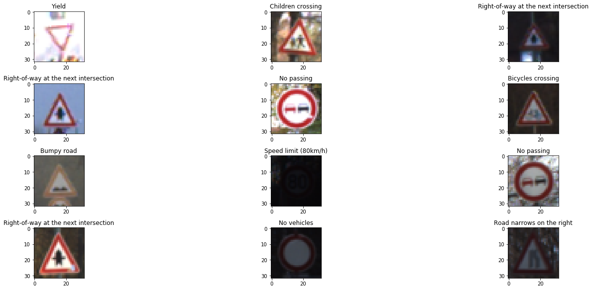
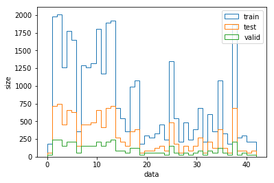
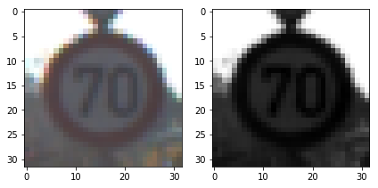
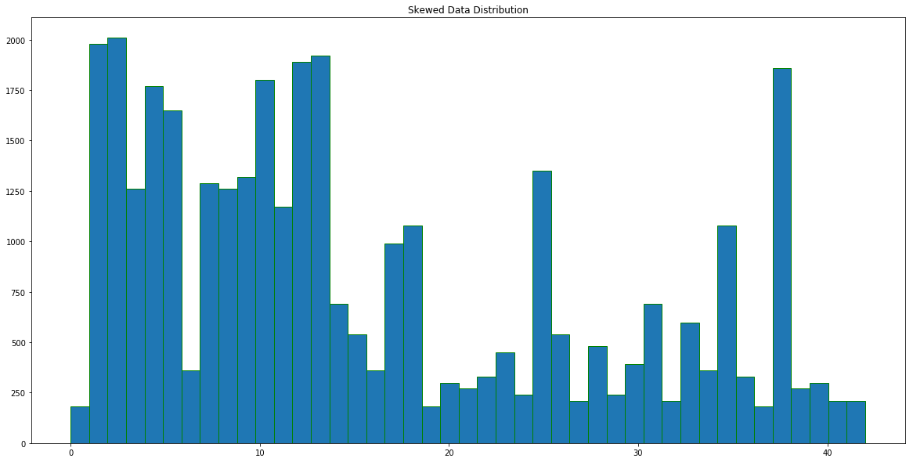
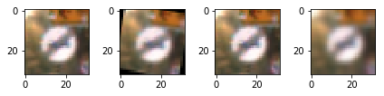

#**Traffic Sign Recognition**

###Data Set Summary & Exploration

####1. Provide a basic summary of the data set. In the code, the analysis should be done using python, numpy and/or pandas methods rather than hardcoding results manually.

Answer

Number of training examples = 34799
Number of validation examples = 4410
Number of testing examples = 12630
Image data shape = (32, 32, 3)
Number of classes = 43

####2. Include an exploratory visualization of the dataset.

Here is an exploratory visualization of the data set. This is a random selection of the images along with their labels -

This is a histogram representing the distribution of the data in the training/test and validation dataset.

I observed that the number of samples was heavily skewed so this dataset would benefit from some data augmentation to compensate for fewer images (in some examples)

###Design and Test a Model Architecture

####1. Preprocessing

- Normalization
My first step involved normalization of the data to a range [0, 1] using the equation (X_train - 128)/ 128.

Pixel values often lie in the [0, 255] range. Feeding these values directly into a network may lead to numerical overflows. It also turns out that some choices for activation and objective functions are not compatible with all kinds of input. The wrong combination results in a network doing a poor job at learning.

- Converting to Grayscale

I used the np.mean function to convert the images to grayscale format
Converting the image to grayscale format reduces the noise in our data and also reduces the original data size (which means less unnecessary details for the network to learn).

- Augmenting Data

We observed in our earlier histogram that the data distribution is skewed -

Based on this I estimated that on average if we have 1000 samples of data for every example that should be sufficient for our dataset.

I augmented the data using the following techniques
- Image Rotation
- Adding noise
- Adding affine transformation
- Adding blur

These are some of the result samples -

####2. Describe what your final model architecture looks like including model type, layers, layer sizes, connectivity, etc.) Consider including a diagram and/or table describing the final model.

The model I used is identical to the Lenet Model. I tried experimenting with dropout layer with little result.

Layer 1: Convolutional. Input = 32x32x1 Output = 28x28x6
Max Pooling (Stride 1x2x2x1 ) + RELU Activation

Layer 2: Convolutional. Input = 28x28x6 Output = 14x14x6.
Max Pooling (Stride 1x2x2x1 ) + RELU Activation
Flatten the Layer

Layer 3: Convolutional. Input = 400 Output = 200
ReLU Activation

Layer 4: Fully Connected. Input = 120. Output = 84

Layer 5: Fully Connected. Input = 84. Output = 43

Learning rate = 0.001
Optimizer = AdamOptimizer

####3. Describe how you trained your model. The discussion can include the type of optimizer, the batch size, number of epochs and any hyperparameters such as learning rate.

| Dataset  |  Validation Accuracy  |  Test Accuracy |
|---|---|---|
| With Old data | 90.0 | 90.6|
| With Augmented Data | 95.1 | 93.4|

With the augmented data we are already getting 93.5% accuracy.
Based on these results I stuck to using my augmented data.

To train the model I tried tuning the following hyperparameters

| Batch size  |  Validation Accuracy  |  Test Accuracy |
|---|---|---|
| 128  | 95.1 | 93.4 |
| 512 |  92.0 | 89.0 |
| 1024 |  88.0 | 88.1 |

| Number of epochs  | Validation Accuracy  | Test Accuracy |
|---|---|---|
| 10  | 93.2  | 90.1
| 25  |  95.1 | 93.4 |
| 50 |  93.7 | 91.4 |  

I expected lower validation accuracy for lower learning rates.

| Learning Rate  | Validation Accuracy  |  Test Accuracy  |  
|---|---|---|
| 0.1 |  92.4 |  91.2 |  
| 0.01  | 93.7  |  89.3|
| 0.001 |95.1 | 93.4 |

Final
Batch Size: 128
Number of epochs: 25
Learning Rate:

###Test a Model on New Images

####1. Choose five German traffic signs found on the web and provide them in the report. For each image, discuss what quality or qualities might be difficult to classify.

I chose 5 normal traffic signs from the Wikipedia article on German Images. I expected a high rate of accuracy as these seem pretty easy to classify. Here is a sample of the images -

####2. Discuss the model's predictions on these new traffic signs and compare the results to predicting on the test set. At a minimum, discuss what the predictions were, the accuracy on these new predictions, and compare the accuracy to the accuracy on the test set.

I tested the models Accuracy with prediction and these were the results

It correctly classified 4 of the 5 images giving it an accuracy of 80%

####3. Describe how certain the model is when predicting on each of the five new images by looking at the softmax probabilities for each prediction. Provide the top 5 softmax probabilities for each image along with the sign type of each probability. (OPTIONAL: as described in the "Stand Out Suggestions" part of the rubric, visualizations can also be provided such as bar charts)

For the images my top 5 Softmax probablities were predicted as follows

For the wrongly predicted Stop Sign we observe that stop sign was had the 3rd highest probablity among the samples.
