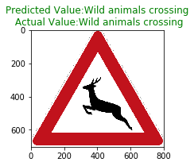

#**Traffic Sign Recognition**

###Data Set Summary & Exploration

####1. Provide a basic summary of the data set. In the code, the analysis should be done using python, numpy and/or pandas methods rather than hardcoding results manually.

Answer

Number of training examples = 34799
Number of validation examples = 4410
Number of testing examples = 12630
Image data shape = (32, 32, 3)
Number of classes = 43

####2. Include an exploratory visualization of the dataset.

Here is an exploratory visualization of the data set. This is a random selection of the images along with their labels -

This is a histogram representing the distribution of the data in the training/test and validation dataset.

I observed that the number of samples was heavily skewed so this dataset would benefit from some data augmentation to compensate for fewer images.

###Design and Test a Model Architecture

####1. Preprocessing

- Normalization
My first step involved normalization of the data to a range [0, 1] using the equation (X_train - 128)/ 128.

Pixel values often lie in the [0, 255] range. Feeding these values directly into a network may lead to numerical overflows. It also turns out that some choices for activation and objective functions are not compatible with all kinds of input. The wrong combination results in a network doing a poor job at learning.

- Converting to Grayscale

I used the np.mean function to convert the images to grayscale format
Converting the image to grayscale format reduces the noise in our data and also reduces the original data size (which means less unnecessary details for the network to learn).

- Augmenting Data

We observed in our earlier histogram that the data distribution is skewed.

Based on this I estimated that on average if we have 1000 samples of data for every example that should be sufficient for our dataset.

I augmented the data using the following techniques
- Image Rotation
- Adding noise
- Adding brightness
- Adding blur

These are some of the result samples -

####2. Describe what your final model architecture looks like including model type, layers, layer sizes, connectivity, etc.) Consider including a diagram and/or table describing the final model.

I experimented with different models before choosing my final one. This is a table describing the accuracy I achieved with each model

Architecture 1

| Architecture   | Validation Accuracy | Test Accuracy |
|----------------|---------------------|---------------|
| Architecture 1 | 92.0                | 90.5          |
| Architecture 2 | 96.6                | 94.6          |
| Architecture 3 | 98.4                | 95.7          |

I changed the layout of the convolutional layers. I removed the maxpooling for the first layer based on the procedure followed by [the published baseline](http://yann.lecun.com/exdb/publis/pdf/sermanet-ijcnn-11.pdf)

I added extra fully connected layers and added dropout with an initial value of 0.7 to manage the dropout.

Based on my experimentation with dropout and adding more layers I chose to stick to the final architecture (Architecture 3).

----
** Final Architecture **

My network used the Lenet Lab as a starting point. I added dropout, convolution and fully-connected layers on top of the current layers

Layer 1
Input: 32 x 32 x 1 image
Conv: (3 x 3 x 32 filter, Stride 1, Ouputs : 30 x 30 x 32 )
Relu Activation

Layer 2
Input: 30 x 30 x 32
Conv: (3 x 3 x 32 filter, Stride 1, Output: 28 x 28 x 32 )
Relu Activation
Maxpool ( 2 x 2 kernel, 2 x 2 stride )

Layer 3
Input: 14 x 14 x 32
Conv: (3 x 3 x 64 filter, Stride 1, Output: 12 x 12 x 64 )
Relu Activation
Maxpool ( 2 x 2 kernel, 2 x 2 stride )

Layer 4
Input: 6 x 6 x 64
Conv: (3 x 3 x 64 filter, Stride 1, Output: 4 x 4 x 64 )
Relu Activation

Flatten 4 x 4 x 64 output to 1024 to feed to FC Layers

Layer 4
Input: 6 x 6 x 64
Conv: (3 x 3 x 64 filter, Stride 1, Output: 4 x 4 x 64 )
Relu Activation

Layer 5
Input: 1024
Output : 512
Relu Activation + Dropout (keep_prob=0.7)

Layer 6
Input: 512
Output : 256
Relu Activation + Dropout (keep_prob=0.7)

Layer 7
Input: 256
Output : 128
Relu Activation

Layer 8
Input: 128
Output : 43
Relu Activation

-----

The architecture was trained with the following hyperparameters -

Learning Rate = 0.001
Keep Probability = 0.7
Epochs = 10
Batch Size = 128

####3. Describe how you trained your model. The discussion can include the type of optimizer, the batch size, number of epochs and any hyperparameters such as learning rate.

| Dataset        | Validation Accuracy | Test Accuracy |
|----------------|---------------------|---------------|
| Old Data       | 97.5                | 95.7          |
| Augmented Data | 98.4                | 96.5          |

To train the model I tried tuning the following hyperparameters -

| Batch size  |  Validation Accuracy  |  Test Accuracy |
|---|---|---|
| 128  | 98.4 | 96.5 |
| 256  | 98.2  | 95.4 |
| 512 |  97.6 | 95.4 |

| Learning Rate  | Validation Accuracy  |  Test Accuracy  |  
|---|---|---|
| 0.1 |  2.0 |  2.1 |  
| 0.01  | 2.0  |  0.7 |
| 0.001 | 98.4 | 96.5 |

| Keep Probability  | Validation Accuracy  |  Test Accuracy  |  
|---|---|---|
| 0.5 |  98.6 |  95.9 |  
| 0.6  | 97.6  |  95.9 |
| 0.7 | 98.4 | 96.5 |
| 0.9 | 96.5 | 94.3 |

**Final Model Details**
Dataset : Augmented Dataset
Batch Size : 128
Number of epochs : 25
Learning Rate : 0.001
Keep Probability: 0.7

From this I came to the conclusion that the learning rate has the maximum impact on the final model.

####4. Describe the approach taken for finding a solution and getting the validation set accuracy to be at least 0.93. Include in the discussion the results on the training, validation and test sets and where in the code these were calculated. Your approach may have been an iterative process, in which case, outline the steps you took to get to the final solution and why you chose those steps. Perhaps your solution involved an already well known implementation or architecture. In this case, discuss why you think the architecture is suitable for the current problem.

A) The approach I used to train the model involved preprocessing the data, training, test and validation sets, augmenting additional data and experimenting with the network model and the hyperparameters.

Training the model was the most challenging part which I have highlighted here -

My first step was to use the original [LeNet architecture](http://yann.lecun.com/exdb/publis/pdf/lecun-01a.pdf) architecture and seeing how well this neural network can work. This network had a 92% validation accuracy and 90% test accuracy with the augmented and preprocessed dataset.

I adapted this model and added an additional more convolutional layers. I made the filters bigger so that each filter is capable of representing more information about the image overall. I also removed some of the pooling layers so that there can be more data passed from one layer to another. This resulted in a validation accuracy of 96.6 and a test accuracy of 94.6.  

The final architecture which I settled on involved adding additional fully-connected layers. I felt that by adding additional fully-connected layers and dropout it would prevent overfitting the network and the test accuracy would increase. I settled for a final validation accuracy of 98.4% and a test accuracy of 95.7%.

I carried out a number of experiments with the hyperparameters as mentioned in the previous question in order fine-tune my model and determined the learning rate has drastic effects on the models overall performance.

###Test a Model on New Images

####1. Choose five German traffic signs found on the web and provide them in the report. For each image, discuss what quality or qualities might be difficult to classify.

These are the traffic signs I chose from the net -

Sign 1: Keep right
This sign is superimposed along with a solar light. I want to see if my model can distinguish it given other unknown noisy data in the background.

Sign 2: Stop
The stop sign is at an angle with trees in the background. Background noise should not prevent the model from predicting the results.

Sign 3: Speed Limit 60
There are various different speed limits possible. I want to see how good my model is at determining one speed limit over the other.

Sign 4: Wild Animal Crossing
There may be confusion amongst this sign and children and pedestrain crossing. I want to see if the model I have trained is smart enough to figure that out.

Sign 5: Children crossing
This sign is rotated and has another sign (School) along with it. I want to see if the model can figure out important features of this sign without getting confused by the other signs.

####2. Discuss the model's predictions on these new traffic signs and compare the results to predicting on the test set. At a minimum, discuss what the predictions were, the accuracy on these new predictions, and compare the accuracy to the accuracy on the test set.

I tested the models Accuracy with prediction and these were the results

It correctly classified 2 of the 5 images giving it an accuracy of 40% which is very low.
My model is definitely overfitting the data based on the dataset provided. It is unable to deal with noise from external objects.

Image 1 : Keep Right - It predicts it as priority road. The solar panel above the image confuses the model about the shape so it is unable to describe the image correctly.

Image 2 : Stop - Stop sign is correctly predicted

Image 3 : Speed Limit 60 - It is unable to predict whether the number is 60 or 80 km/h.s

Image 4 : Wild Animal Crossing - Correctly Predicted

Image 5 : Children Crossing - Different from the children crossing sign of the dataset. It confuses this with the go straight or left sign below it.

####3. Describe how certain the model is when predicting on each of the five new images by looking at the softmax probabilities for each prediction. Provide the top 5 softmax probabilities for each image along with the sign type of each probability.

For the images my top 5 Softmax probablities were predicted as follows

For the incorrectly predicted images
Image 1: Keep Right - Keep right was not mentioned in the list. The model fails when external objects are present. Any external data can be cropped to see if results improve for a given image.

Image 3 : Speed Limit 60 - Speed limit for 60 was the second highest amongst the possible signs. This shows that maybe a smaller CNN can be tuned for the speed limits alone to improve accuracy.

Image 5 : Children Crossing - Completely different signs were mentioned in the top 5 softmax probabilities. Maybe some images with signs like this representing scenarios where two signs may be augmented need to be added to the training dataset.
